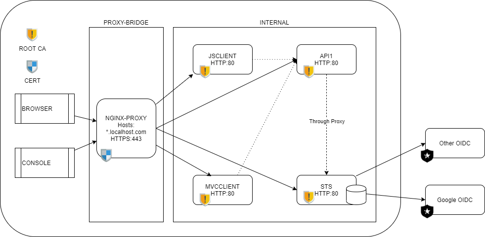

# Overview


This project provides a more complete web interface, but still based on the quick-start UI for [Identity Server 4](https://github.com/IdentityServer/IdentityServer4).

The `docker-compose` setup puts the Identity Server (STS), API's and any clients behind a reverse-proxy (nginx) and offers SSL-termination at the proxy.



## Compile it yourself

```bash
docker-compose build
```
