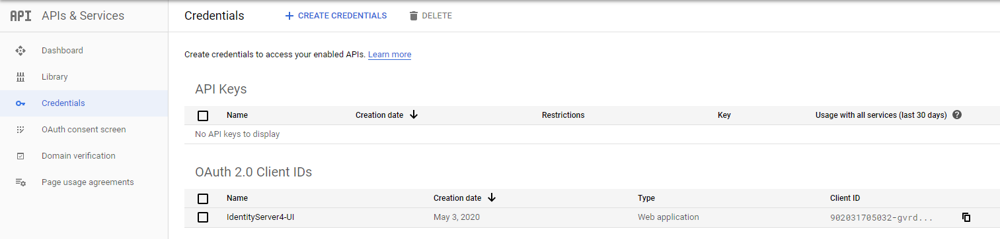

# Prerequisites

## DNS

We need some resolving capabilities in order for the project to work. The domain `localhost.com` is used here to represent the domain this setup is hosted on. The domain-name needs to be FQDN (fully qualified domain name).

Thus first, we need the domain `localhost.com` to resolve to the docker-host machine. If you want this to work on your local machine only, use the first option.

### DNS on docker-host machine only

Edit your hosts file (`C:\Windows\system32\drivers\etc\hosts`) as administrator and add the following entries.

```custom
127.0.0.1 localhost.com sts.localhost.com api.localhost.com jsclient.localhost.com mvcclient.localhost.com
```

This way your host machine resolves `localhost.com` and its subdomains to itself.

### DNS through external DNS server

As this setup is intended for development purposes, we can make due with a domain that can only be resolved by the host machine. If you want this to work on the complete network, you need an external DNS server that resolves for that domain. Your containers need to be able to resolve that same domain. In other words, you would need a DNS proxy as well. That would need some extra configuration using [dns-proxy-server](https://github.com/mageddo/dns-proxy-server), which is left out here. Using a public DNS allows you to use Let's Encrypt.

## Certificates

We also need certificates in order to serve on HTTPS. We'll make our own self-signed certificates with [mkcert](https://github.com/FiloSottile/mkcert).

> If the domain is publicly available through DNS, you can use [Let's Encypt](https://letsencrypt.org/). Nginx-proxy has support for that, which is left out in this setup.

### Install MkCert

You can either just download the binary and add it to your `PATH` environment variable or use choclately to install it.

```powershell
choco install mkcert
```

### Create the root certificate

Use [mkcert](https://github.com/FiloSottile/mkcert) to generate local self-signed certificates.

On windows `mkcert -install` must be executed under elevated Administrator privileges. Then copy over the CA Root certificate over to the project as we want to mount this in later into the containers without using an environment variable.

```bash
cd compose/nginx/certs
mkcert --install
copy $env:LOCALAPPDATA\mkcert\rootCA.pem ./cacerts.pem
copy $env:LOCALAPPDATA\mkcert\rootCA.pem ./cacerts.crt
```

### Create the `localhost.com` certificates

Generate a certificate for `localhost.com` with wildcards for the subdomains. The name of the certificate files need to match with actual domain-names in order for the nginx-proxy to pick them up correctly. We want both the crt-key and the pfx version.

```bash
cd compose/nginx/certs
mkcert -cert-file localhost.com.crt -key-file localhost.com.key localhost.com *.localhost.com
mkcert -pkcs12 localhost.com.pfx localhost.com *.localhost.com
```

## Adding Google OIDC (optional)

We want to allow authentication through google as well although it being optional. For this to work, we need to create a OAuth 2.0 Client in the [Google developer console](https://console.cloud.google.com/).

Add a new project and enable the Google+ API


Add a OAuth 2.0 Client called `IdentityServer4-UI`. You can choose whatever name you like.



And configure the possible redirects. We added both the `localhost` with the ports (for running directly from Visual Studio without docker-compose) and the URI's used by `docker-compose`.


Capture the ClientID and ClientSecret on the same page on the right.

We want to add these to the user secret json (to avoid checking them in to git). The user secrets are mounted automatically through docker-compose into the STS container, so these are available there.

Create a `C:\Users\<username>\AppData\Roaming\Microsoft\UserSecrets\347ad42e-1172-4c2d-a1f6-115dc46e55be\secrets.json`

with the following content

```json
{
  "Google:ClientSecret": "<your google client secret>",
  "Google:ClientId": "<your google client id>"
}
```

That should get the Google authentication to work properly.
